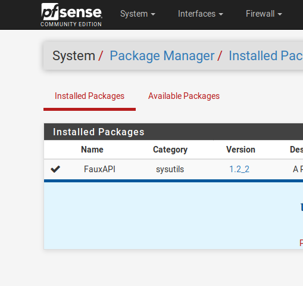

# FauxAPI - release packages

Until the FauxAPI is added to the pfSense FreeBSD-ports tree you will need to 
install manually as shown

Simply download the latest `pfSense-pkg-FauxAPI` package file directly onto 
your pfSense system and perform a manual pkg install as shown in the
installation example below.  It takes just 2x commands to install and just 1x
command to de-install if you need to.

## Current Version
 - pfSense-pkg-FauxAPI-1.2_2.txz
 - SHA256: aa01bd1750c325584291f7842ae7c0c20d9b82c9b5fa38bd79cce61c2f88031f

## Installation Example
```
[2.3.5-RELEASE][root@pfsense]/root: set fauxapi_baseurl='https://raw.githubusercontent.com/ndejong/pfsense_fauxapi/master/package'
[2.3.5-RELEASE][root@pfsense]/root: set fauxapi_latest=`curl --silent $fauxapi_baseurl/LATEST`
[2.3.5-RELEASE][root@pfsense]/root: fetch $fauxapi_baseurl/$fauxapi_latest
pfSense-pkg-FauxAPI-1.2_2.txz                 100% of   33 kB  254 kBps 00m00s
[2.3.5-RELEASE][root@pfsense]/root: pkg install $fauxapi_latest
pkg: Warning: Major OS version upgrade detected.  Running "pkg-static install -f pkg" recommended
Updating pfSense-core repository catalogue...
pfSense-core repository is up to date.
Updating pfSense repository catalogue...
pfSense repository is up to date.
All repositories are up to date.
The following 2 package(s) will be affected (of 0 checked):

New packages to be INSTALLED:
	pfSense-pkg-FauxAPI: 1.2_2 [unknown-repository]

Installed packages to be REINSTALLED:
	pkg-1.10.1_1 [pfSense] (ABI changed: 'freebsd:10:x86:64' -> 'freebsd:11:x86:64')

Number of packages to be installed: 1
Number of packages to be reinstalled: 1

The process will require 1 MiB more space.
3 MiB to be downloaded.

Proceed with this action? [y/N]: y
[1/2] Fetching pkg-1.10.1_1.txz: 100%    3 MiB  85.1kB/s    00:35    
Checking integrity... done (0 conflicting)
[2/2] Reinstalling pkg-1.10.1_1...
Extracting pkg-1.10.1_1: 100%
You may need to manually remove /usr/local/etc/pkg.conf if it is no longer needed.
[1/2] Installing pfSense-pkg-FauxAPI-1.2_2...
[1/2] Extracting pfSense-pkg-FauxAPI-1.2_2: 100%
Saving updated package information...
done.
Loading package configuration... done.
Configuring package components...
Custom commands...
Menu items... done.
Writing configuration... done.
[2.3.5-RELEASE][root@pfsense]/root:
```

## Uninstallation Example
```
[2.3.4-RELEASE][root@pfsense]/root: 
[2.3.4-RELEASE][root@pfsense]/root: pkg delete pfSense-pkg-FauxAPI
Checking integrity... done (0 conflicting)
Deinstallation has been requested for the following 1 packages (of 0 packages in the universe):

Installed packages to be REMOVED:
	pfSense-pkg-FauxAPI-1.1

Number of packages to be removed: 1

Proceed with deinstalling packages? [y/N]: y
[1/1] Deinstalling pfSense-pkg-FauxAPI-1.1...
Removing FauxAPI components...
Menu items... done.
[1/1] Deleting files for pfSense-pkg-FauxAPI-1.1: 100%
Removing FauxAPI components...
Configuration... done.
[2.3.4-RELEASE][root@pfsense]/root: 
```

## FauxAPI - System Menu


## FauxAPI - Package Manager

