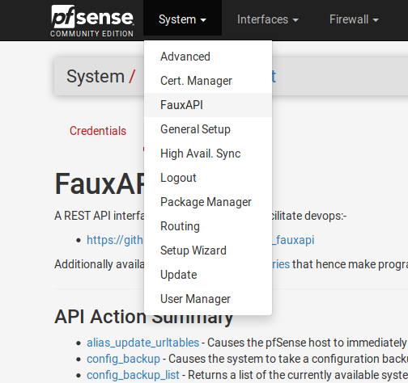

# FauxAPI - release packages

Until the FauxAPI is added to the pfSense FreeBSD-ports tree a binary release is
made herewith allowing you to get started right away

You'll need to download the latest `pfSense-pkg-FauxAPI` package file directly 
onto your pfSense system and perform a manual pkg install as shown below.

```
[2.3.2-RELEASE][root@pfsensedev]/root: 
[2.3.2-RELEASE][root@pfsensedev]/root: curl -O https://raw.githubusercontent.com/ndejong/pfsense_fauxapi/master/package/pfSense-pkg-FauxAPI-1_2.txz
[2.3.2-RELEASE][root@pfsensedev]/root: 
[2.3.2-RELEASE][root@pfsensedev]/root: pkg install pfSense-pkg-FauxAPI-1_2.txz
Updating pfSense-core repository catalogue...
pfSense-core repository is up-to-date.
Updating pfSense repository catalogue...
Fetching meta.txz: 100%    944 B   0.9kB/s    00:01    
Fetching packagesite.txz: 100%  110 KiB 112.8kB/s    00:01    
Processing entries: 100%
pfSense repository update completed. 406 packages processed.
Checking integrity... done (0 conflicting)
The following 1 package(s) will be affected (of 0 checked):

New packages to be INSTALLED:
	pfSense-pkg-FauxAPI: 1_2 [unknown-repository]

Number of packages to be installed: 1

Proceed with this action? [y/N]: y
[1/1] Installing pfSense-pkg-FauxAPI-1_2...
[1/1] Extracting pfSense-pkg-FauxAPI-1_2: 100%
Saving updated package information...
done.
Loading package configuration... done.
Configuring package components...
Custom commands...
Menu items... done.
Writing configuration... done.
[2.3.2-RELEASE][root@pfsensedev]/root: 
```

## FauxAPI - Menu

